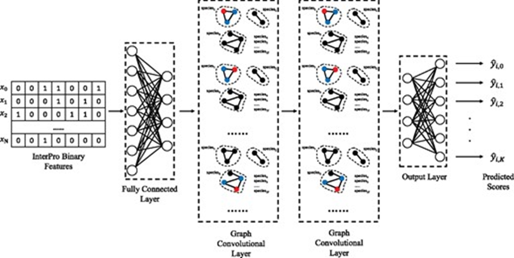
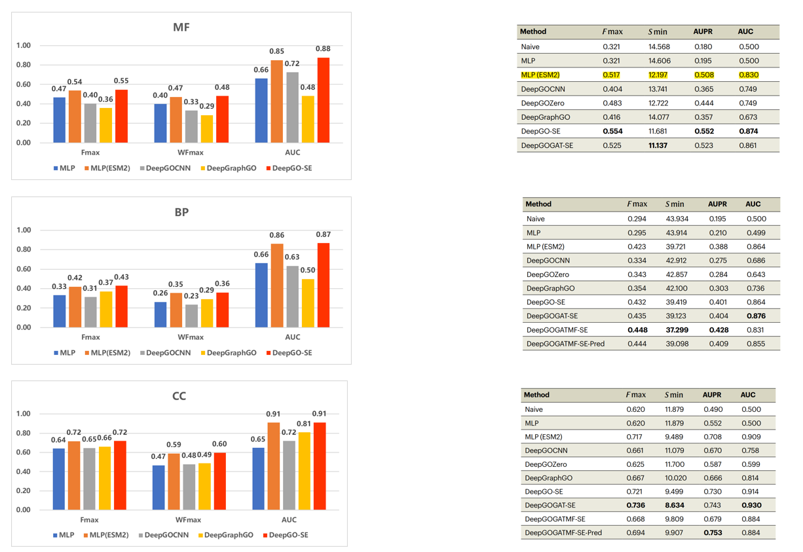

# DeepGO-SE: Protein function prediction as Approximate Semantic Entailment

DeepGO-SE, a novel method which predicts GO functions from protein
sequences using a pretrained large language model combined with a
neuro-symbolic model that exploits GO axioms and performs protein
function prediction as a form of approximate semantic entailment.

This repository contains script which were used to build and train the
DeepGO-SE model together with the scripts for evaluating the model's
performance.

# Dependencies
* The code was developed and tested using python 3.10.
* Clone the repository: `git clone https://github.com/bio-ontology-research-group/deepgo2.git`
* Create virtual environment with Conda or python3-venv module. 
* Install PyTorch: `pip install torch==2.0.1 torchvision==0.15.2 torchaudio==2.0.2`
* Install DGL: `pip install dgl==1.1.2+cu117 -f https://data.dgl.ai/wheels/cu117/repo.html`
* Install other requirements:
  `pip install -r requirements.txt`

# Running DeepGO-SE model (with GOPlus axioms)
data path in wc: /home/share/huadjyin/home/s_sukui/02_data/08_protein/GO/deepgo2
Follow these instructions to obtain predictions for your proteins. You'll need
around 30Gb storage and a GPU with >16Gb memory (or you can use CPU)
* Download the [data.tar.gz](https://deepgo.cbrc.kaust.edu.sa/data/deepgo2/data.tar.gz)
* Extract `tar xvzf data.tar.gz`
* Run the model `python predict.py -if data/example.fa`

# Docker container
We also provide a docker container with all dependencies installed:
`docker pull coolmaksat/deepgose` \
This repository is installed at /deepgo2 directory. To run the scripts you'll
need to mount the data directory. Example: \
`docker run --gpus all -v $(pwd)/data:/workspace/deepgo2/data coolmaksat/deepgose python predict.py -if data/example.fa`

# Training the models
To train the models and reproduce our results:
* Download the [training-data.tar.gz](https://deepgo.cbrc.kaust.edu.sa/data/deepgo2/training-data.tar.gz)
  - The training data includes both UniProtKB/SwissProt dataset and the neXtProt
    evaluation dataset.
  - go.obo, go.norm, go-plus.norm - Gene Ontology and normalized axiom files
  - mf, bp and cc subfolders include:
    - train_data.pkl - training proteins
    - valid_data.pkl - validation proteins
    - test_data.pkl - testing proteins
    - nextprot_data.pkl - neXtProt dataset proteins (except cc folder)
    - terms.pkl - list of GO terms for each subontology
    - interpros.pkl - list of InterPRO ids used as features
    - ppi.bin, ppi_nextprot.bin - PPI graphs saved with DGL library
* train.py and train_gat.py scripts are used to train different versions of
  DeepGOSE and DeepGOGATSE models correspondingly
* train_cnn.py, train_mlp.py and train_dgg.py scripts are used to train
  baseline models DeepGOCNN, MLP and DeepGraphGO.
* Examples:
  - Train a single DeepGOZero MFO prediction model which uses InterPRO annotation features \
    `python train.py -m deepgozero -ont mf`
  - Train a single DeepGOZero CCO prediction model which uses ESM2 embeddings \
    `python train.py -m deepgozero_esm -ont cc`
  - Train a single DeepGOGAT BPO prediction model which uses predicted MF features \
    `python train_gat.py -m deepgogat_mfpreds_plus -ont bp`
* Training 10 models for entailment:
  - DeepGO-SE models: `./train_se.sh <model_name> <ontology>`
  - DeepGOGAT-SE models: `./train_gat_se.sh <model_name> <ontology>`
    
## Evaluating the predictions
The training scripts generate predictions for the test data that are used
to compute evaluation metrics.
* To evaluate single predictions run evaluate.py script. Example: \
  `python evaluate.py -m mlp -td test -on mf`
* To evaluate approximate entailment predictions use evaluate_entailment.py
  script. Example: \
  `python evaluate_entailment.py -m deepgozero_esm -td nextprot -ont cc` \
  Note: this script requires multiple trained models with performance reports
  on the validation set.

# Generating the data
The data used in to train our models are available for download. However,
if you like to generate a new dataset follow these steps:
* Download [Gene Ontology](https://geneontology.org/docs/download-ontology/).
You'll need go.obo, go.owl and go-plus.owl files and save them into data folder.
We use Groovy scripts to process the ontology files. Install Groovy by
following the instructions [here](https://groovy-lang.org/install.html)
and execute the following commands: \
  - Normalize GO: \
    `groovy groovy/Normalize.groovy -i data/go.owl -o data/go.norm`
  - Filter out GO-Plus non EL axioms: \
    `groovy groovy/makeEL.groovy data/go-plus.owl data/go-plus-el.owl`
  - Normalize GO-Plus: \
    `groovy groovy/Normalize.groovy -i data/go-plus-el.owl -o data/go-plus.norm`
* Download [UniProt-KB](https://ftp.uniprot.org/pub/databases/uniprot/current_release/knowledgebase/complete/uniprot_sprot.dat.gz) data
  and save it to the data folder.
* Download StringDB v11.0 [protein.actions.v11.0.txt.gz](https://stringdb-static.org/download/protein.actions.v11.0.txt.gz)
* Install [Diamond](https://github.com/bbuchfink/diamond/wiki/2.-Installation)
* Run data generation script: \
  `sh generate_data.sh`

# Model Parase

## DeepGOGraph

> https://doi.org/10.1093/bioinformatics/btab270

## DeepGO MLP

# Reproduction of Result

# Citation

If you use DeepGO-SE for your research, or incorporate our learning
algorithms in your work, please cite: Maxat Kulmanov, Francisco
J. Guzman-Vega, Paula Duek, Lydie Lane, Stefan T. Arold, Robert
Hoehndorf; DeepGO-SE: Protein function prediction as Approximate
Semantic Entailment
